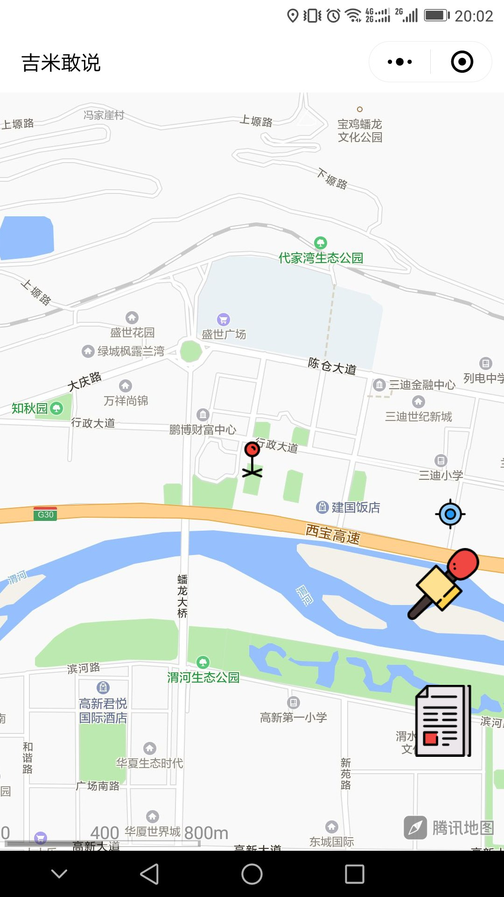
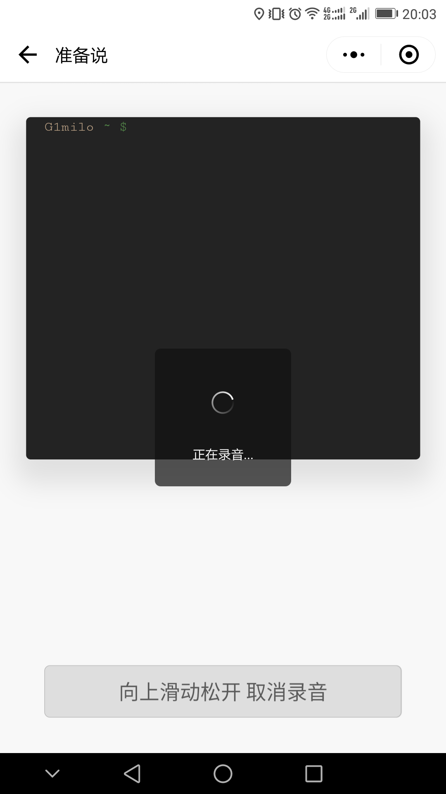
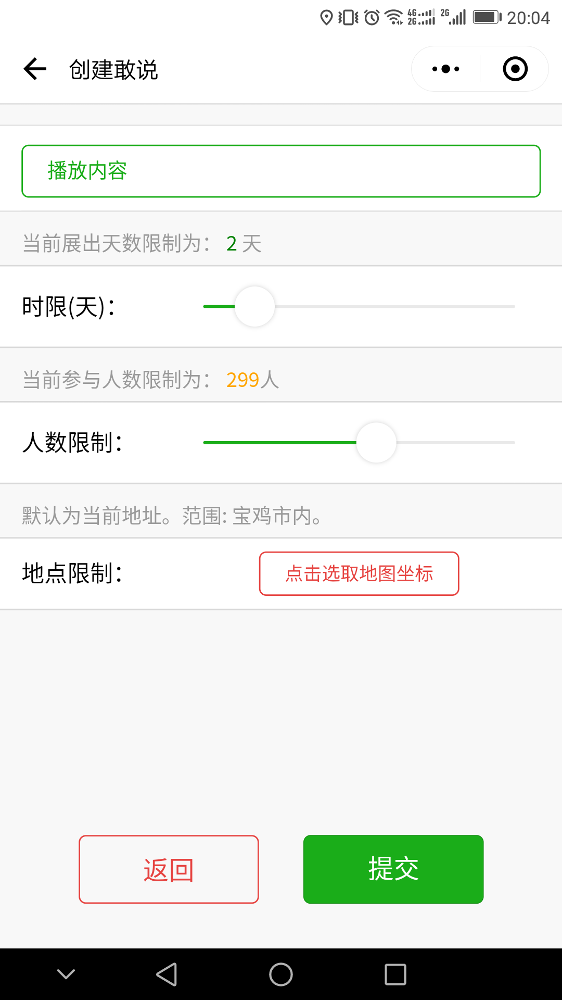
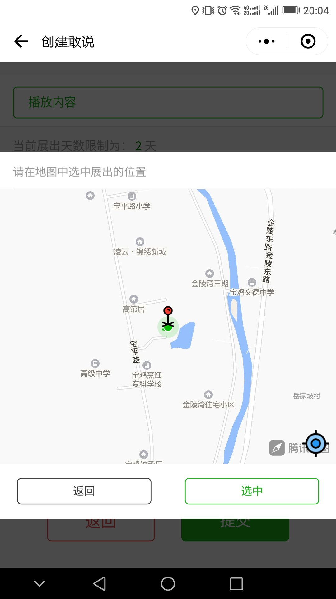
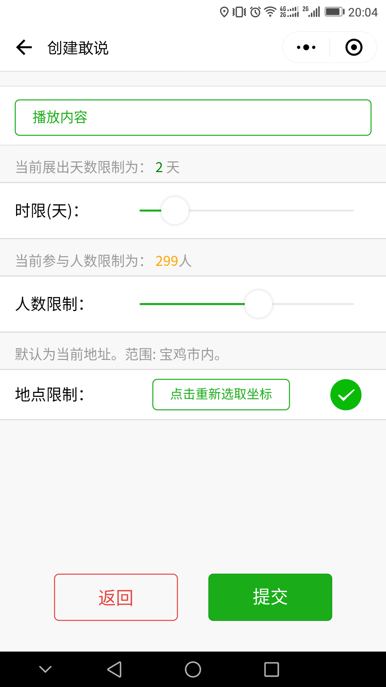
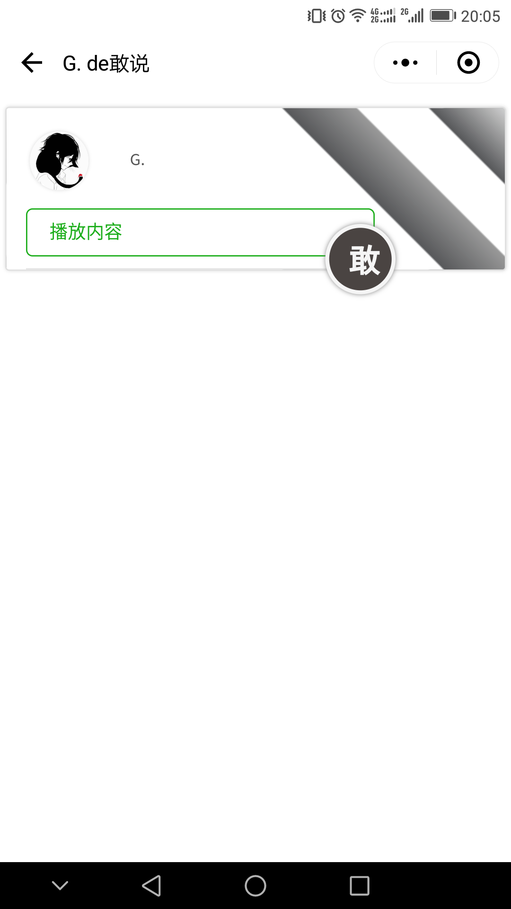
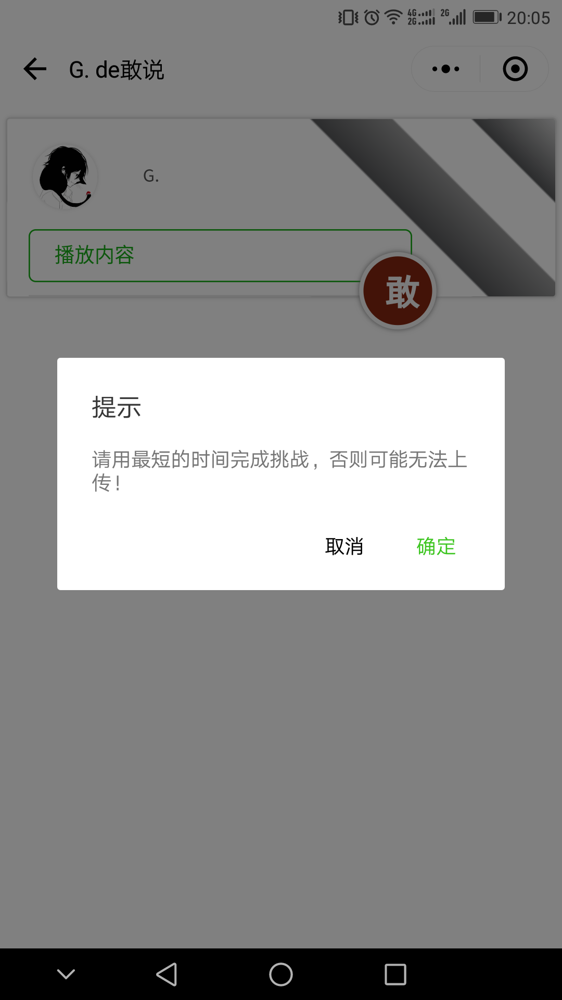
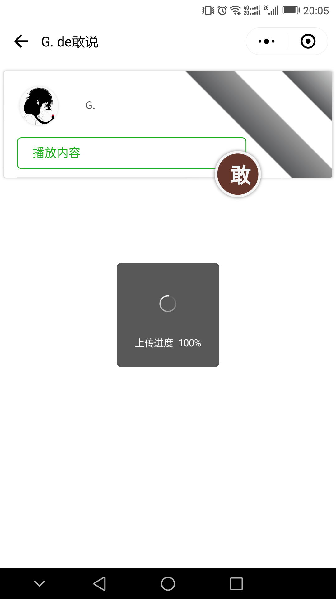
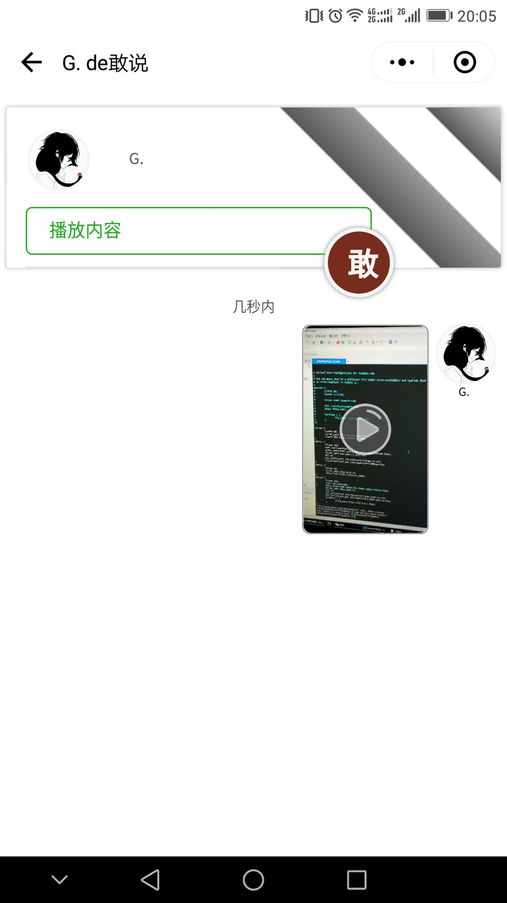
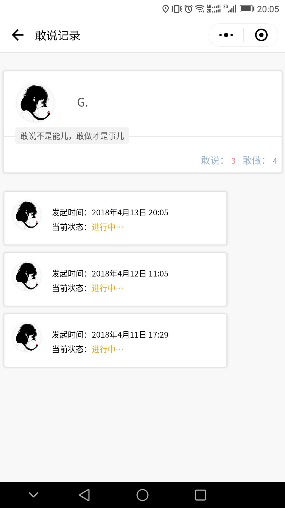

# 吉米敢说

学习wepy 的制作的软件
微信号：g1miology欢迎加好友一起学习

## 使用

```language: javascript
git clone https://github.com/g1mi/JMGS.git your-path
cd your-path
npm i  //等待安装完所需要的包
npm run dev
上面步骤完成后用微信开发者工具导入目录下dist文件夹即可
```

### 基本功能

- [x] 地图显示敢说
- [x] 添加敢说 - 分享音频
- [x] 浏览敢说 - 浏览音频
- [x] 添加敢说 - 分享短视频
- [x] 浏览敢说记录

#### 权限过滤

- [ ] 每人每次只可以发布一条敢说, 付费发布更多
- [ ] 不能挑战自己的敢说
- [ ] 挑战时限，人数可根据以往参与度解锁，或付费解锁

#### 缓存功能

- [ ] 要命的视频音频流量

#### 后台功能

- [ ] bulletin展报信息
- [ ] 修改bulletin展报信息（自定义统计变量）
- [ ] 定时统计（今日，总等），定时删除（过期数据删除）

#### 排序功能

- [ ] 时间倒序
- [ ] 热度

#### 评分功能

- [ ] 陌生人👍 👎（任意浏览者均可以，比重较低）
- [ ] 挑战者👍 👎（挑战后可以点赞，且只有一次的非己选择机会，比重较高）
- [ ] 题主（在敢说时间过期后可以进行，比重最高）
- [ ] 换算成绩，挑战后的若干时间内显示成绩

#### 社交红包

- [ ] 悬赏任务（题主设置金额，最高点赞者获得）
- [ ] 支持挑战者（陌生人红包）

### 用到的包

> [moment.js](https://github.com/moment/moment)    
> [xstream.js](https://github.com/staltz/xstream)

> [七牛对象存储](https://www.qiniu.com/products/kodo) 很地道的开发者友好云，dev几乎是免费开发，20g呢！    

### 屏幕截图


<div style="display:flex">












</div>


### license

MIT
